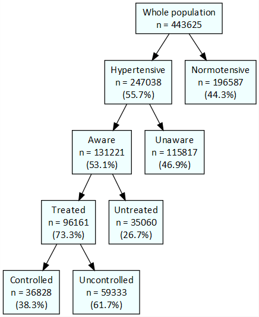
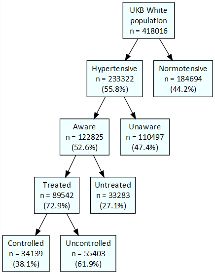
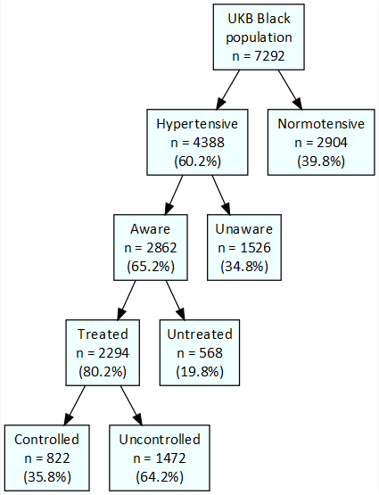
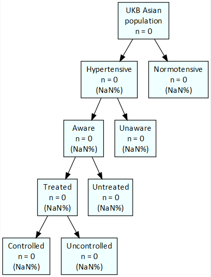
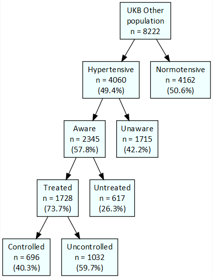
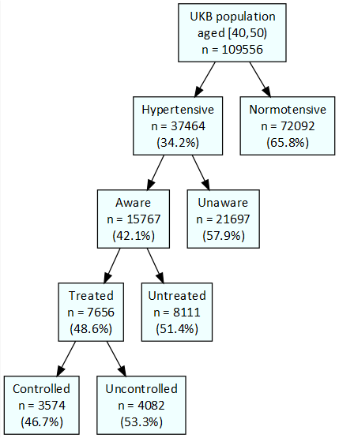
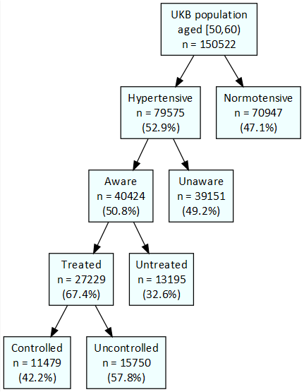
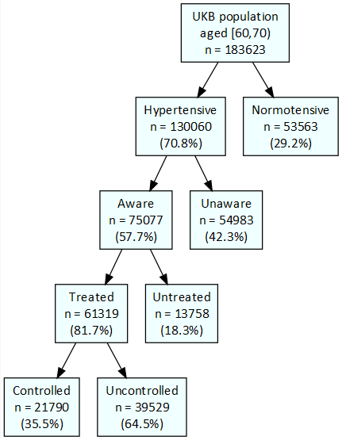

```{r setup, include=FALSE}
knitr::opts_chunk$set(echo = FALSE)
library(kableExtra)
library(knitr)
library(DiagrammeR)
library(DiagrammeRsvg)
library(magrittr)
library(svglite)
library(rsvg)
library(png)

source("K:/TEU/APOE on Dementia/Statistical Analysis/JCfunctions.R")

data <- readRDS(file="K:\\TEU\\APOE on Dementia\\Data Management\\R_Dataframes_TLA\\38358\\Organised\\Hypertension\\Neo\\HTN_excl.rds")

hypertensives <- data[data$evidenceHTN==TRUE & !is.na(data$evidenceHTN),]
treated <- data[data$treated==TRUE & !is.na(data$treated),]
```


```{r fig2, include=FALSE, echo=FALSE, results='asis'}
ethnicity <- c("White", "Black", "Asian", "Other")
agegrp <- c("[40,50)", "[50,60)", "[60,70)")
dflist <- c(list("Whole population"=data), 
            lapply(ethnicity, function(x) data[data$ethnicity==x,]),
            lapply(agegrp, function(x) data[data$agegrp==x,])
            )
names(dflist) <- c("Whole population", paste0("UKB ", ethnicity, "\npopulation"), paste0("UKB population\naged ",agegrp))
filenames <- list("Wholepop", "White", "Black", "Asian", "Other", "40_50", "50_60", "60_70")
names(filenames) <- names(dflist)

grlist <- list()
for(dfname in names(dflist)){
  df <- dflist[[dfname]]
  nlist <- list(wholepop=nrow(data))
  pctlist <- list()
  for(variable in c("evidenceHTN", "aware", "treated", "controlled")){
    var <- paste0(variable, "_")
    tab <- table(df[[var]])
    pct <- round(100*prop.table(tab),1)
    nlist[[variable]] <- tab
    pctlist[[variable]] <- pct
  }
  svg <- export_svg(DiagrammeR::grViz("K:\\TEU\\APOE on Dementia\\Statistical Analysis\\NeoHypertension\\RMarkdown\\HTNtree.gv")) %>% charToRaw %>% rsvg %>% png::writePNG(paste0(filenames[[dfname]],'.png'))
}
# DiagrammeR::grViz("K:\\TEU\\APOE on Dementia\\Statistical Analysis\\NeoHypertension\\RMarkdown\\HTNtree.gv")
# 
# 
# 
# 
# 
# 
# 
# 
```


```{r table1, include=TRUE, echo=FALSE}


for(var in c("gender", "agegrp", "age", "ethnicity", "ISCED", "employment", "SBP", "DBP")){
  if(is.factor(treated[[var]])){
    n <- table(treated[[var]], useNA='ifany')
    pct <- round(100*prop.table(n),2)
    variable <- rep(var, dim(n))
  } else {
    med <- median(treated[[var]])
    IQR <- round(quantile(treated[[var]], na.rm=TRUE),1)
    n <- med
    pct <- paste0("(", IQR[4], "-", IQR[2], ")")
    variable <- var
  }
  do.call("<-",list(var, cbind(n, pct)))
  # df <- data.frame(variable, as.numeric(n), as.numeric(pct))
}
kable(rbind(gender, agegrp, age, ethnicity, ISCED, employment, SBP, DBP))
# kable(df) %>% collapse_rows(columns=1)


```

# Print new line


```{r logisticregression, include=TRUE, echo=FALSE}


#multivariable logistic regression for DV control, among treated individuals. covariates to include in model are: age group, gender, BMI (categorical), smoking status, whether has CVD (comorbidity category - yes/no), duration of hypertension, whether ever screened for bowel cancer, household income (continuous, quintiles), Townsend vulnerability/deprivation  index (score), occupation type (categorical), geographic region/country (Wales, England, Scotland, Northern Ireland)


model <- glm(controlled ~ agegrp + gender + BMIcat + Smo_Status + CVD + HTNdx + income + townsend_depind + ISCED + employment, data=treated, family="binomial" )
model <- glm(controlled ~ agegrp + gender, data=treated, family="binomial" )
# model
kable(printlogresults(model))

```


